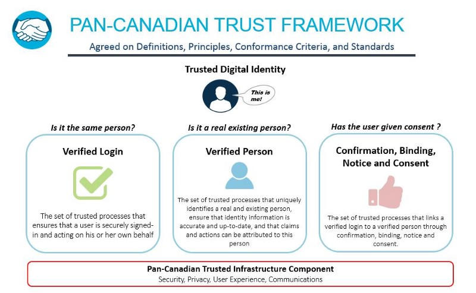

# README File for the Pan-Canadian Trust Framework

The Pan-Canadian Trust Framework is how we will formalize the approval and acceptance of a “trusted digital identity.”

A trusted digital identity is a digital representation of who you are, which you can use to access high-value government services, such as, social benefits, renewing a passport or filing taxes.

A trusted digital identity is much more than a username and password — it’s something you can use anywhere and answers three key questions about you — Are you the same person each time? (i.e., not an imposter). Are you a real person? (i.e., not a fictitious person or a bot). Have you given consent? (i.e., do you actually understand the terms and conditions, and have given informed consent).

Additionally, this trusted digital version of you needs to be conveyed through an ecosystem of providers and technologies you can trust.

We are building on the Pan-Canadian approach to identity management that we have developed over the past decade. The Pan-Canadian Trust Framework is the next step to formalize the requirements that we need to agree on to trust each other. The trust framework focuses on ensuring the integrity of identity management business processes, so we can rely on each others’ digital identities, originating from the Provinces, Territories, and Federal Government (in the case of immigration), instead of creating program-centred identities.

This Pan-Canadian approach to trusting identities has benefits for both Canadians and governments. For Canadians, they will be able to seamlessly access government services on-demand across jurisdictions in a matter of moments — not days. For governments, accepting trusted digital identities from other jurisdictions, greatly streamlines program enrolment processes and reduces costs — because the client is already known and trusted.

As we implement, there remains lots of work and discovery ahead. Currently, we are testing the framework within real, operational contexts to ensure that conformance criteria make sense and that identity management business processes can be assessed for integrity, and therefore be trusted.

Today, we are focusing on the most important and most impactful use cases first: accepting a trusted digital identity from a Province or Territory for use within federal programs. This will be a big win for all Canadians.

It is important that we get this right as it will set the stage for how we deliver services to Canadians. With an eye to the future, we are watching the emerging platforms, such as blockchain and digital wallets. The trust framework is focused on the integrity of identity management business processes, but it will also ensure technical interoperability within a larger ecosystem using today’s platforms and platforms of the future.

To conclude, the goal of the trust framework is simple — Canadians should be able to access any service from any level of government through any platform without worrying about their security and privacy.

More information can be found on [GCcollab](https://gccollab.ca)
